# Overview

This lab guides you to build a serverless solution in AWS that uses Machine Learning to analyze the sentiment and the entities appearing in a stream of tweets.

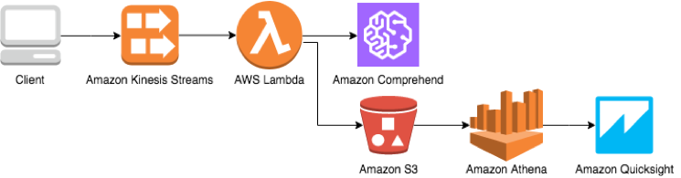

The solution will use a Kinesis producer that listens to new tweets that match with a series of terms (in the example 'Amazon' and 'AWS', but you can use others, just make sure they are popular, as the more data you get, the better analytics you can run), and streams them as records into a Kinesis Data Stream.

Those records are consumed by a Lambda function that analyzes their text with Comprehend to detect their sentiment and find entities. Both sentiment and found entities for each tweet are stored in separate objects in an S3 bucket. Each object contains a batch of analyzed tweets in JSON format, with one object per line to be able to use Athena, and a flat structure to make it easier to work with them.

Once the data is in S3, you will create Athena tables and QuickSight data sets in order to run analysis and visualizations over the collected tweets.

# Prerequisites

- An AWS account with enough privileges
- Use a region that supports QuickSight, e.g.: eu-west-1.
- A Twitter account.
- AWS Cloud 9 Configured.

# Set up your environment

## Install Tweepy

In a AWS Cloud 9, execute the following command

```pip install tweepy```

# Create a Kinesis Data Stream

Using a Kinesis Data Stream, you will continuously stream records to be consumed by other applications. Those records are durably stored for a default of 24 hours, so you can decouple stream producers from consumers reliably. In this lab, those records will be tweets, and there will be just one Lambda function consuming those tweets, but you could have multiple consumers performing different tasks.

1. In the AWS Management Console, click on **Services** and then on **Kinesis** under the Analytics category.
2. Click on **Get started** , then on the **Create data stream** button and fill-in the form like in the figure below or with the name you want (write it down, as it will be used later). Finally, click on the **Create Kinesis stream** button to start the creation process.

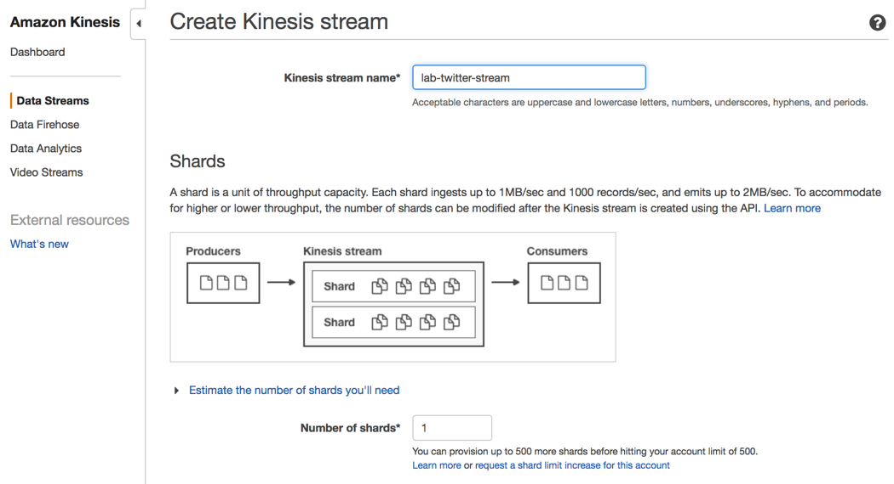

# Create a Kinesis producer

In this step, you create a simple producer that runs locally on your laptop. This producer listens to new tweets using [Tweepy](http://www.tweepy.org/), an easy-to-use Python library for accessing the Twitter API. In order to improve the efficiency of the producer, it buffers the incoming tweets in small batches and sends them to the Kinesis Data Stream using the _put_records_method of the Kinesis API. Another solution, better fitting for high-throughput, more efficient environments, could be to use the [Kinesis Producer Library](https://docs.aws.amazon.com/streams/latest/dev/developing-producers-with-kpl.html) (KPL), an easy-to-use, highly configurable library that helps you write to a Kinesis data stream. It acts as an intermediary between your producer application code and the Kinesis Data Streams API actions.

1. Create a Twitter read-only application, as described [here](http://docs.inboundnow.com/guide/create-twitter-application/). Take note of the consumer key, consumer secret, OAuth access token, and OAuth access token secret.
2. With your favorite text or code editor, create a local text file in a folder in your laptop and call it _twitter_to_kinesis.py_.
3. Paste the following code and substitute the place holders (<placeholder>) with the appropriate consumer key, consumer secret, OAuth access token, OAuth access token secret, and the stream name used in the previous step.
```
#! /usr/bin/python

from __future__ import absolute_import, print_function

import boto3

import json

import sys

from tweepy.streaming import StreamListener

from tweepy import OAuthHandler

from tweepy import Stream

from tweepy import TweepError

import datetime

CONSUMER_KEY = "<your_consumer_key>"

CONSUMER_SECRET = "<your_consumer_secret>"

ACCESS_TOKEN = "<your_access_token>"

ACCESS_TOKEN_SECRET = "<your_token_secret>"

STREAM_NAME = "<your_kinesis_data_stream_name>"

BATCH_SIZE = 10

kinesis = boto3.client('kinesis')

# A listener handles tweets that are received from the stream.

# This is a basic listener that writes received tweets to a Kinesis Stream in batches.

class KinesisOutListener(StreamListener):

    n = 0

    tweets = []

    # Function triggered when there is new data on the Twitter stream.

    def on_data(self, data):

        # This function writes sets of ten tweets to a Kinesis Stream.

        self.n += 1

        tweet = json.loads(data)

        # Let's append the tweet and use the 'location' as a partitioning key.

        self.tweets.append({

            'Data': json.dumps(tweet),

            'PartitionKey': tweet.get('location', 'None')

        })

        #print(self.tweets)

        if self.n == BATCH_SIZE:

            print('{} tweets streamed'.format(BATCH_SIZE))

            kinesis.put_records(StreamName=STREAM_NAME, Records=self.tweets)

            self.n = 0

            self.tweets = []

        return True

    def on_error(self, status):

        print(status)

def start():

    try:

        listener = KinesisOutListener()

        auth = OAuthHandler(CONSUMER_KEY, CONSUMER_SECRET)

        auth.set_access_token(ACCESS_TOKEN, ACCESS_TOKEN_SECRET)

        stream = Stream(auth, listener)

        stream.filter(track=['Amazon', 'AWS'], languages=['en'])

    except KeyboardInterrupt:

        sys.exit()

    except Exception as e:

        print('{0} - Unhandled exception: {1}'.format(datetime.datetime.now(), e))

        print("Trying to reconnect...")

        # Not a fancy error handling

        start()

if __name__ == '__main__':

    start()
```
1. Run the python code from a terminal window in the folder where you placed the file with this command:
```
python ./twitter_to_kinesis.py
```
1. Once some tweets have been streamed to Kinesis, go back to the AWS Management Console and, in the Dashboard, click on the data stream you previously created. There, click on the **Monitoring** tab and check some "put records" statistics (it may take a few minutes to see some data).

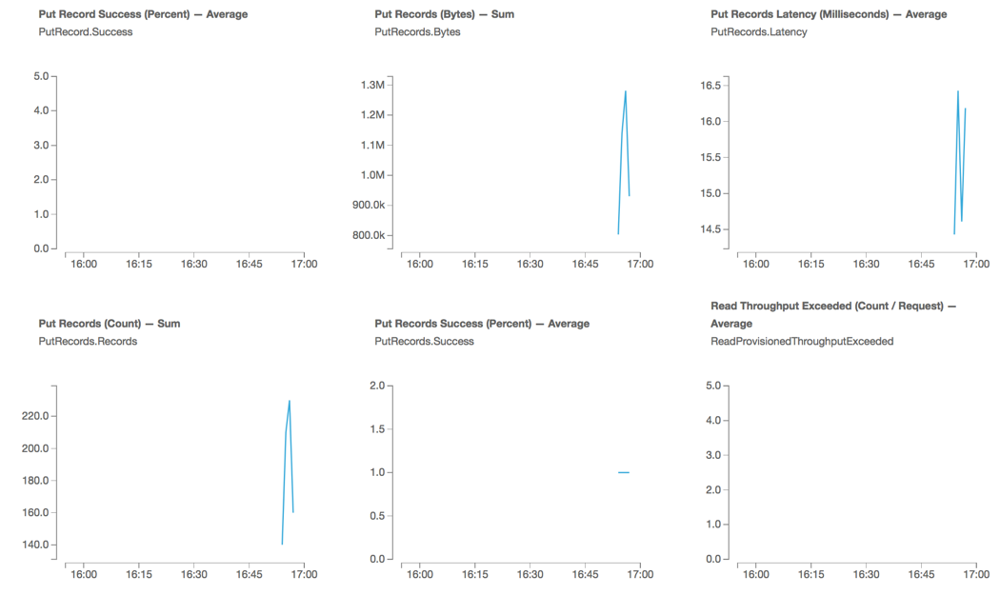

# Create an S3 Bucket

Now that you are getting some data into Kinesis, before setting up the Lambda function that will analyze and store the results of the analysis, you need to create an Amazon S3 bucket. This bucket will host all of the objects produced by the Lambda function and serve them to Amazon Athena to run queries over them.

1. In the AWS Management Console, click on **Services** and then on **S3**.
2. Click on the **Create bucket** button.
3. Give the bucket a name like _lab-analyzed-tweets-yourname_ (this name needs to be globally unique) in the same region where you created your Kinesis data stream.

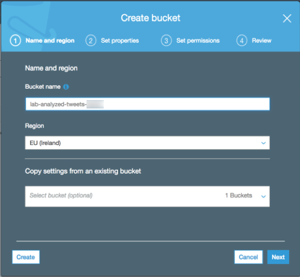

1. Click on the **Create** button, which will apply the default settings (non-encrypted, private, full permissions for owner, etc.).

# Create a Lambda stream consumer function

1. In the AWS Management Console, click on **Services** and then on **Lambda** under the **Compute** category.
2. Click on **Create a function** and select **Author from scratch**.
3. Give the function a name like _tweets_analyzer_, select the **Python 2.7** runtime, select the **Create new role from template(s)** option, and give the role a name such as _lab-tweets-analyzer-lambda-role_.

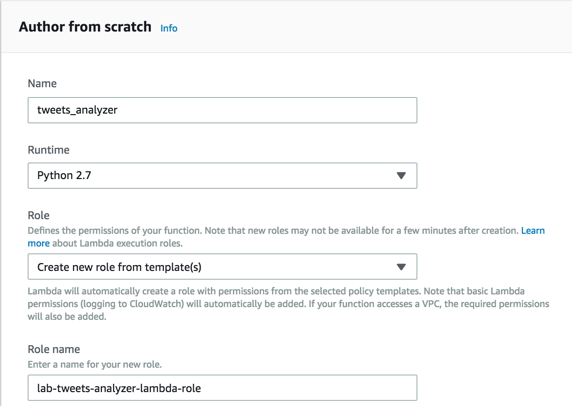

1. Click on **Create function**. This action creates the Lambda function and its associated role with some permissions., but these permissions are not enough to run the solution, as it needs to read from a Kinesis data stream, use Amazon Comprehend, and write on S3. You will deal with that after the function is created and configured.
2. Now you need to populate the function code. Scroll up to the designer and click on the Lambda function button with the name you gave it to open the function code editor. Scroll down and substitute the code in the editor with the following code, changing the bucket name to your own.
```
import boto3

import base64

import json

BUCKET_NAME = '<your_bucket_name>'

kinesis = boto3.client('kinesis')

s3 = boto3.resource('s3')

comprehend = boto3.client('comprehend')

def lambda_handler(event, context):

    records = event['Records']

    # Iterate through records and build a string list

    strings = []

    tweets = []

    for record in records:

        # Kinesis data in Python Lambdas is base64 encoded

        payload = base64.b64decode(record['kinesis']['data'])

        tweet = json.loads(payload)

        if 'id' in tweet:

            strings.append(tweet.get('text',''))

            tweets.append({

                'id': tweet['id'],

                'text': tweet.get('text',''),

                'created_at': get_datetime_from_tweet(tweet)})

    # Detect sentiment and entities found in the text of the tweets

    sentiments = comprehend.batch_detect_sentiment(TextList=strings, LanguageCode='en')

    entities = comprehend.batch_detect_entities(TextList=strings, LanguageCode='en')

    # Build a string that contains the original tweet id, text and its sentiment and entities

    i = 0

    sentiment_data = ''

    entities_data = ''

    for tweet in tweets:

        # Flatten the objects to make them easily queriable

        sentiment_data += json.dumps({

            'tweet_id': tweet['id'],

            'tweet_text': tweet['text'],

            'tweet_date': tweet['created_at'],

            'sentiment': sentiments['ResultList'][i]['Sentiment'],

            'positive_score': sentiments['ResultList'][i]['SentimentScore']['Positive'],

            'negative_score': sentiments['ResultList'][i]['SentimentScore']['Negative'],

            'mixed_score': sentiments['ResultList'][i]['SentimentScore']['Mixed'],

            'neutral_score': sentiments['ResultList'][i]['SentimentScore']['Neutral']

        }) + '\n'

        for entity in entities['ResultList'][i]['Entities']:

            entities_data += json.dumps({

                'tweet_id': tweet['id'],

                'tweet_text': tweet['text'],

                'tweet_date': tweet['created_at'],

                'entity': entity['Text'],

                'score': entity['Score'],

                'type': entity['Type']

            }) + '\n'

        i += 1

    # Save the objects in S3

    sentiment_object = s3.Object(BUCKET_NAME, get_unique_file_name('sentiment'))

    sentiment_object.put(Body=sentiment_data)

    entities_object = s3.Object(BUCKET_NAME, get_unique_file_name('entities'))

    entities_object.put(Body=entities_data)

    return

def get_unique_file_name(folder=''):

    import datetime

    from random import randint

    # Adding a random prefix to improve partitioning and uniqueness

    unique_filename = folder + '/{:03}-'.format(randint(0,999)) + datetime.datetime.now().isoformat() + ".json"

    return unique_filename

# This function extracts the date time in a proper format for the

def get_datetime_from_tweet(tweet):

    import time

    ts = time.strftime('%Y-%m-%d %H:%M:%S', time.strptime(tweet['created_at'],'%a %b %d %H:%M:%S +0000 %Y'))

    return ts
```
1. Scroll down and, in the **Basic settings** section, set the timeout to 1 minute.
2.  Click the **Save** button on the top right corner.

# Edit the Lambda function IAM Role

In this section, you are going to add managed policies to the role that the Lambda function assumes to access AWS resources.

1. In the AWS Management Console, click on **Services** and then on **IAM**.
2. Click on **Roles** , search the role that you created in the previous section (suggested name was _lab-tweets-analyzer-lambda-role_), and click on its name.
3. Click on the **Attach policy** button.
4. Search for and select AmazonKinesisReadOnlyAccess, ComprehendReadOnly, and AmazonS3FullAccess. Please, note that these are AWS managed policies, hence not controlling access to specific resources within a service. You can grant access to certain API actions or to specific resources within the services (such as specific S3 buckets or Kinesis streams) by using custom policies or resourced-based policies if supported (e.g.: S3 bucket policies).
5. Click on **Attach policy**. This will show the policies attached.

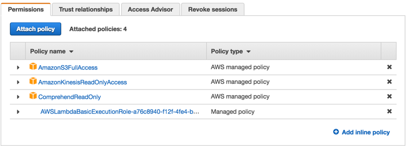

Figure 6: Role configuration

# Add a trigger to the Lambda function

The Lambda function requires a trigger to be executed, in this lab it is a Kinesis trigger.

1. Go back to the AWS Lambda console and click on the function you created earlier. In the **Designer** block of the current screen, click on the Kinesis button on the left side. Kinesis will appear as a trigger for the function as in the following figure.

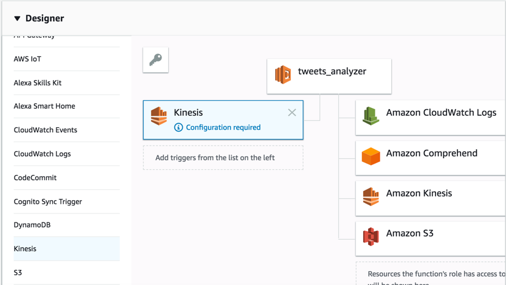

1. Scroll down and configure the **Batch size** to 10. This matches with the default batch size of the producer, but it can be different. Click on the **Add** button.

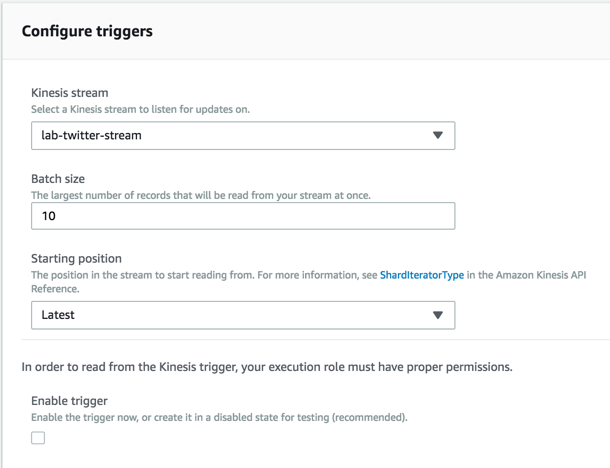

1. Click on the configured trigger and switch it to **Enabled** , then click **Save**.

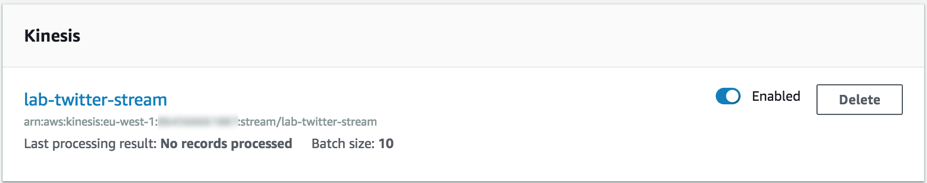

1. Now that the trigger is enabled, your Lambda function will start processing Kinesis records; you can monitor the function invocations in CloudWatch or in the **Monitoring** tab within the function. You can also check your S3 bucket and see that there are new objects.

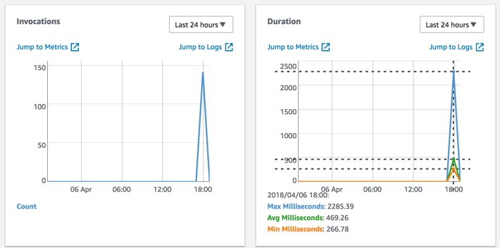

# Create tables in AWS Glue data catalog

In order to leverage the data stored in S3, QuickSight is going to use Athena to run queries. For that is necessary to create two tables, one for the tweets' sentiment and another for their found entities. You can create these tables manually, but AWS Glue can do that for you.

1. In the AWS Management Console, click on **Services** , then on **AWS Glue**.
2. Click on **Databases** on the left side and **Add database**. Name the database as _lab_analyzed_tweets_ and click **Create**.
3. In order to create the tables, AWS Glue uses a Crawler. Click on **Crawlers** , then on **Add crawler**.
4. Name the crawler _tweets_crawler_ and click **Next**.
5. Select **S3** as the data store and introduce _s3://yourbucketname_ in the **Include path** field. Click **Next** twice.
6. Select **Create an IAM role** and add a suffix to the name such as _lab-tweets-analysis_. Click **Next** twice.
7. Select the _lab_analyzed_tweets_ table click **Next**.
8. Click **Finish**.
9. Select the newly created crawler and click **Run crawler**. It will take around half a minute to finish.
10. Once it has finished, click on Tables on the left and then inspect each of the two tables. You can see some properties of the tables and their schema.

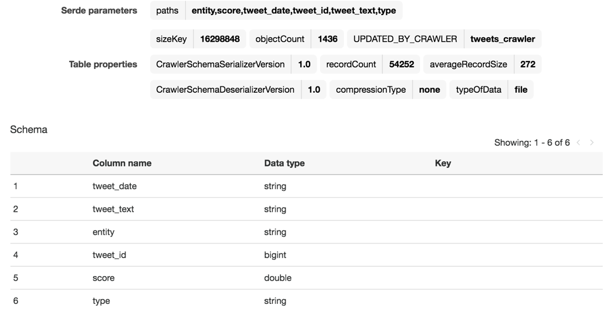

1. The crawler didn't identify the column _tweet_date_ as a timestamp, so you need to change it. For this, click on **Edit schema** on the top right corner, then click on the _tweet_date_ column, select the **TIMESTAMP** type, and click **Update**. Finally, click **Save**.
2. Do the same with the other table.
3. Go to the Athena console: click on **Services** , then on **Athena**. There, you can select the newly created database and run queries against them, for example:
```
SELECT sentiment, count(\*) AS NumberOfTweets FROM sentiment GROUP BY sentiment
```
Now, you are ready to use QuickSight to run analysis and visuals over the analyzed tweets!

# Create a Standard QuickSight account

You can skip this section if you already have a QuickSight account.

1. Click on **Services** and then on **QuickSight**.
2. Introduce a valid e-mail address.
3. Click on Sign up for QuickSight, select the Standard edition and then **Continue**.
4. Select the region you have been using in this lab.
5. Click **Finish**.
6. Click **Go to Amazon QuickSight**.

# Give QuickSight permissions to access S3

QuickSight needs permissions to access the data in your S3 buckets.

1. On the AWS Management Console, click on **Services** , then on **IAM**.
2. Click on **Roles** on the left side.
3. Find a role whose name starts with **aws-quicksight-service-role** and click on it.
4. Click on **Add inline policy**.
5. Click on **Service** and select **S3**.
6. Click on **Actions** and select **List** and **Read**.
7. Click on **Resources** and click on **Add ARN** at the **bucket** row.
8. Write the name of your bucket where the analyzed tweets are and click on **Add**.
9. Repeat for the **objects** row and click on **Any** for objects, then click on **Add**.

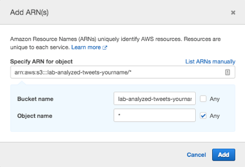

1. Click on Review policy, give it a name such as _lab-quicksight-s3-policy_, and then click on **Create policy**. It should look similar to the following figure.
2. 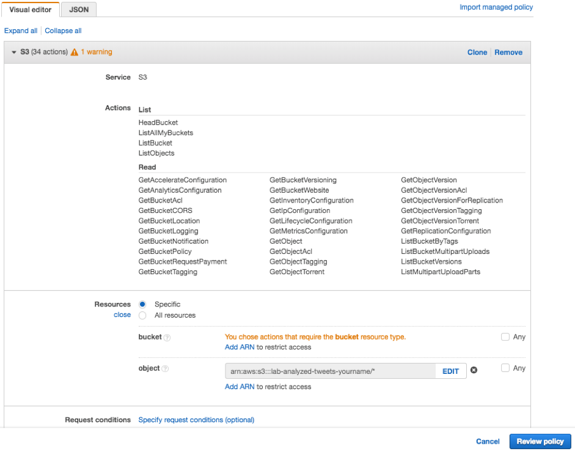

# Create a QuickSight data set

QuickSight works with data sets that you define and can come from several different sources, such as Salesforce, Amazon RDS, Amazon Redshift and more. Once you have created a QuickSight account and are in the QuickSight console, follow these steps:

1. Click on **Manage Data** on the top-right corner, then on **New data set**.
2. Click on Athena and give the data source a name such as tweets-entities, then click on **Create data source**.
3. Select the _lab_analyzed_tweets_ database(or the database you created previously).
4. Select any of the tables and click on **Edit/Preview data**.
5. On the left side, expand the **Tables** tab and select both tables in the database.
6. On the diagram on the right, click on the two pink circles between the tables to configure the join relationship.
7. Under the diagram, click on each table name and select _tweet_id_ as the joined field, then click Apply.

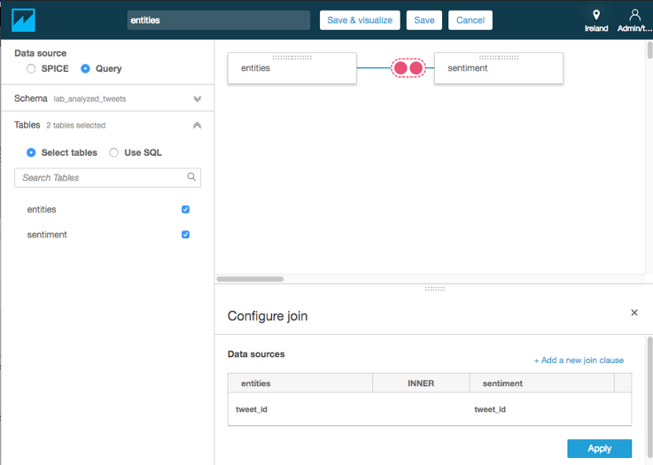

1. Since the two joined tables have some common fields, you can remove the ones coming from one of the tables. Expand the **Fields** tab on the left, that will show all the fields from the joined tables.
2. Deselect _tweet_date_, _tweet_text_ and _tweet_id_ from one of the tables.
3. To make the field names look nicer, it is worth to rename the table name suffix from the fields that are selected. For that, click on the down arrow at the right side of the field name and then on **Rename field** and remove the [tablename] part of the name, then click **Apply**. Do this for _tweet_date_, _tweet_text_ and _tweet_id_.
4. Click on **Save &amp; visualize**.
5. Start exploring visualizations by clicking on the fields on the left side!

You can also create single-table data sets by, in step 4, clicking on the **Select** button.

In order to create a second data set, click on the QuickSight icon on the top-left corner and follow the previous steps, but now select the _sentiment_ table.

# Optional challenge

Now that you have sentiment analysis and entities detection, add key phrase detection to the solution.

# Clean-up

All of the following steps are optional, but you may incur in costs if you don't clean-up.

## Delete QuickSight account

Follow the steps specified [here](https://docs.aws.amazon.com/quicksight/latest/user/closing-account.html).

## Delete assets from AWS Glue data catalog

1. Open a terminal session with the AWS CLI configured to access the account and the region where you have deployed this solution.
2. Run the following command (substitute the name for your own if different) to delete the database.

```aws glue delete-database --name lab_analyzed_tweets```

1. Run the following command (substitute the name for your own if different) to delete the crawler.

```aws glue delete-crawler --name tweets_crawler```

## Delete the Lambda function, its role, and related assets

1. Open a terminal session with the AWS CLI configured to access the account and the region where you have deployed this solution.
2. Run the following command (substitute the name for your own if different) to delete the Lambda function

```aws lambda delete-function --function-name tweets_analyzer```

1. Run the following command (substitute the name for your own if different) to delete the role that the Lambda function assumed

```aws iam delete-role --role-name lab-tweets-analyzer-lambda-role```

## Delete CloudWatch Logs

1. Open a terminal session with the AWS CLI configured to access the account and the region where you have deployed this solution.
2. Run the following command (substitute the name for your own if different) to delete the Lambda function CloudWatch Logs

```aws logs delete-log-group --log-group-name /aws/lambda/tweets_analyzer```

1. Run the following command (substitute the name for your own if different) to delete the AWS Glue CloudWatch Logs

```aws logs delete-log-group --log-group-name /aws-glue/crawlers```

## Delete the S3 Bucket

1. Open a terminal session with the AWS CLI configured to access the account and the region where you have deployed this solution.
2. Before deleting the bucket, first it needs to be emptied. Run the following command (substitute the name for your own).

```aws s3 rm s3://lab-analyzed-tweets-yourname/ --recursive```

1. Run the following command (substitute the name for your own) to delete the bucket.

```aws s3 rb s3://lab-analyzed-tweets-yourname/```

There may be other buckets created by Athena to store results, proceed as previously to delete them substituting the names.